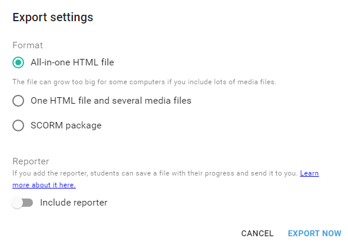

# Lumi Standalone xAPI Wrapper

## General Information

This wrapper is to support xAPI output for h5p interactions exported from the **Lumi** cross-platform h5p desktop app:

- https://lumi.education/
- https://github.com/lumieducation/lumi

The Lumi desktop app allows **offline** h5p authoring via the app (vs. web hosting on h5p website, WordPress, etc.). As of March 2022, it's still in development.

The **Lumi Standalone xAPI Wrapper** takes the interactions exported from Lumi, and along with a few support files can allow the resulting ZIP archive to be uploaded to an LMS like any other xAPI package.

## Instructions

### Lumi
- Download the [latest release of the Lumi desktop app](https://github.com/Lumieducation/Lumi/releases/)
- Create your desired h5p interactions
  - Follow the [standard h5p instructions](https://h5p.org/documentation)
- Export from Lumi
  - *File > Export*
  - You can export as either:
    - All-in-one HTML file
    - One HTML file and several media files
      - If you have images/video
    - *(SCORM package not supported currently, but there's possibly a workaround)*
  
    - 
  - Export the HTML as `h5p.html`

### xAPI Wrapper
- Download and extract the [latest release of the xAPI Wrapper](https://github.com/xapicohort/team-h5p/releases)
- Drop your exported **Lumi h5p** files into the root of the extracted folder
  - Ensure your exported HTML file is named `h5p.html`
- Update the `tincan.xml` file with your **xAPI Activity** information:
  - ID
  - Name
  - Description
- Zip your files to create your xAPI package
- Upload to LMS

## Details
### Benefits
- Doesn't require external hosting for authoring
- Allows xAPI packaging without too much configuration
- Automatically pulls info from the LMS to allow LRS communication
  - LRS and user info
  - Uses the [TinCanJS](http://rusticisoftware.github.io/TinCanJS/) library to assist with processing
- Adds a `launched` and `completed` statement for the "course" that's wrapping the interaction
  - This includes the final score if there is one

### Disadvantages
- This solution currently only works for one H5P interaction, since that's all Lumi currently outputs at once
- There are several quirks to the H5P implementation (and/or Lumi) that required some hacks/workarounds
- This has a dependency on third-party h5p solution
  - If their project is abandoned, it won't receive updates
  - However, any packages resulting from this solution should work for the foreseeable future
